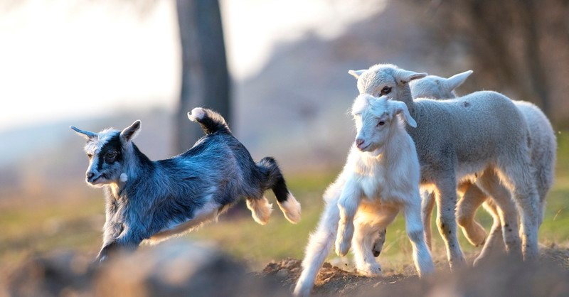

## Animal Resources for a Sustainable Environment

### [When:]{style="color: blue;"}

12 October 2022

14:30-16:30 **(Central European Time)**

### [Where:]{style="color: blue;"} 

online: [chick here to join via GoTo Meeting](
https://meet.goto.com/772034805)

### [Outline]{style="color: blue;"}

The event will focus on recent advancements in animal breeding, management and welfare of livestock other than cattle. Special attention will be giving to species like buffaloes, sheep and goats. These species are efficient converter of poor quality forages into high quality milk and meat and are going to be determinant to economic and environmental sustainability worldwide. Genomic selection as well as application of machine learning algorithms for management purposes are effective solutions for the near future.

The idea is not only to present scientific contributions and on-going projects but also to listen to who, like breeders' associations, are trying to turn ideas into practice.

```{r out.width = "80%", fig.align = "center",echo=F}

```

### LIST OF THE PRESENTATIONS:

#### Scientific Side

-   [Tania Bobbo, IBBA-CNR, Milan, Italy]{style="color: green;"}
-   [Paul Boettcher, NSA-FAO, Rome, Italy]{style="color: green;"}
-   [Bianca Castiglioni, IBBA:CNR, Milan, Italy]{style="color: green;"}
-   [Alessandra Iannuzzi, ISPAAM-CNR, Naples, Italy]{style="color: green;"}

#### Breeder Association Side

-   [ Mayra Goméz, ANASB, Caserta, Italy]{style="color: green;"}
-   [ Alessio Negro, AssoNaPa, Rome, Italy]{style="color: green;"}
